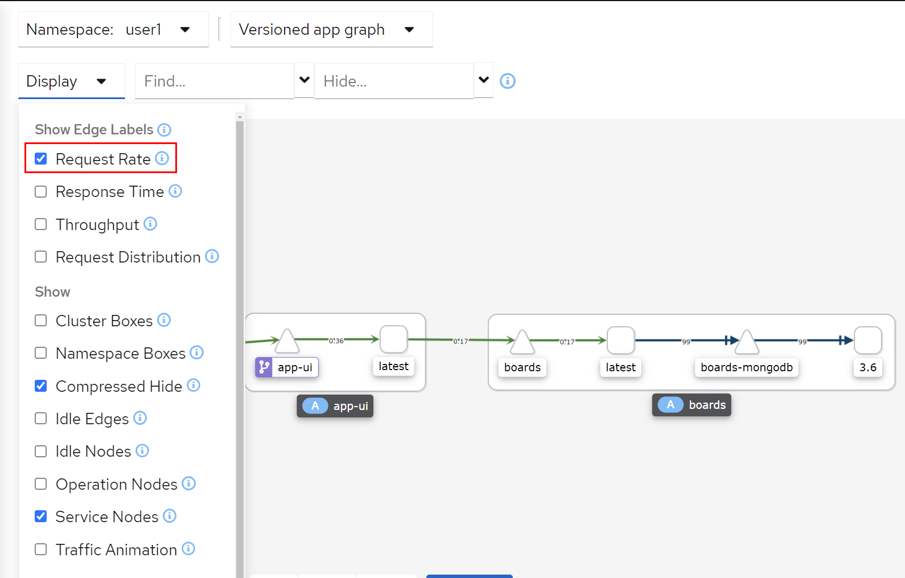

# 관찰 가능성(Observability)을 위한 Kiali 소개

모든 마이크로서비스는 서비스 메시에서 실행됩니다. 따라서 서비스 메시 토폴로지를 시각화 해야 서비스 메시에서 무엇이 실행되고 있으며 어떻게 연결되어 있는지 쉽게 확인할 수 있습니다. 

Istio는 서비스 메시의 콘솔을 제공하는 오픈 소스 프로젝트인 [Kiali][1]를 제공합니다. Kiali를 통해 서비스 메시의 상태를 확인할 수 있으며, 추가로 통합된 Jaeger를 통해 이후 실습에서 다룰 메트릭 쿼리 및 추적이 가능합니다.


## Kiali 둘러보기

Kiali가 여러분의 deployment들을 볼 수 있는지 확인합니다.

```execute
oc get cm kiali -n %username%-istio -o yaml | sed '/DeploymentConfig/d' | oc apply -n %username%-istio -f -
oc rollout restart deployment kiali -n %username%-istio
```

<br>

애플리케이션에 약간의 부하를 주도록 하겠습니다.

<blockquote>
<i class="fa fa-terminal"></i>
애플리케이션 사용자 인터페이스에 부하 주기
</blockquote>

```execute
for ((i=1;i<=100;i++)); do curl -s -o /dev/null $GATEWAY_URL; done
```

<blockquote>
<i class="fa fa-terminal"></i>
사용자 프로필 서비스에 부하 주기
</blockquote>

```execute
for ((i=1;i<=100;i++)); do curl -s -o /dev/null $GATEWAY_URL/profile; done
```

<br>

<blockquote>
<i class="fa fa-terminal"></i>
이제 Kiali 콘솔을 열어 보겠습니다. Kiali의 엔드포인트를 검색합니다.
</blockquote>


```execute
echo $(oc get route kiali -n %username%-istio --template='https://{{.spec.host}}')
```

Output (sample):
```
https://kiali-userx-istio.apps.cluster-naa-xxxx.naa-xxxx.example.opentlc.com
```

<blockquote>
<i class="fa fa-desktop"></i>
브라우저에서 이 URL로 이동합니다. 주어진 OpenShift 유저 정보(%username%)로 로그인합니다.
</blockquote>

로그인하면 Kiali 콘솔이 표시됩니다.

<br/>
*Kiali 첫 화면*

서비스 메시 토폴로지를 살펴보겠습니다.
<br>

<blockquote>
<i class="fa fa-desktop"></i>
왼쪽 메뉴에서 'Graph'로 이동하여 네임스페이스(예: user1)를 선택합니다.
</blockquote>

<blockquote>
<i class="fa fa-desktop"></i>
그리고 오른쪽 화면에서 보여줄 트래픽 메트릭의 범위를 'Last 1m'에서 'Last 10m'으로 변경합니다.
</blockquote>

<br/>
*Kiali 그래프*

이 그래프는 서비스 메시의 마이크로서비스와 이들이 연결되는 방식을 보여줍니다.
엣지 레이블을 통해 서비스 간에 전송되는 트래픽에 대한 정보를 확인할 수 있습니다.


<blockquote>
<i class="fa fa-desktop"></i>
엣지 레이블에 트래픽 정보를 표시하기 위해, 화면처럼 'Display'를 클릭하고 'Show Edge Labels'에서 'Request Rate'를 선택합니다.
</blockquote>

그럼 이제 마이크로서비스 간의 HTTP 트래픽 정보를 볼 수 있습니다.

<br/>
*Request Rate를 설정한 Kiali 그래프*

이어서 서비스 메시에서 실행되는 마이크로서비스를 살펴보겠습니다.

<br>
<blockquote>
<i class="fa fa-terminal"></i>
왼쪽 메뉴에서 'Applications'로 이동합니다.
</blockquote>

<br/>
*Applications에 대한 Kiali View*

<blockquote>
<i class="fa fa-terminal"></i>
이 보기에서 각 마이크로서비스들의 다양한 정보를 확인할 수 있습니다. 'app-ui'를 선택합니다.
</blockquote>

<br/>
*App UI에 대한 Kiali View*

해당 마이크로 서비스의 'health'가 초록색 마크로 표시되어야 합니다.

<blockquote>
<i class="fa fa-terminal"></i>
'트래픽' 탭으로 이동하면 해당 마이크로서비스에서 만들어진 인바운드 및 아웃바운드 호출이 표시됩니다.
</blockquote>

<br/>
*App UI의 인바운드 및 아웃바운드 트래픽 *

<br>

[1]: https://kiali.io
