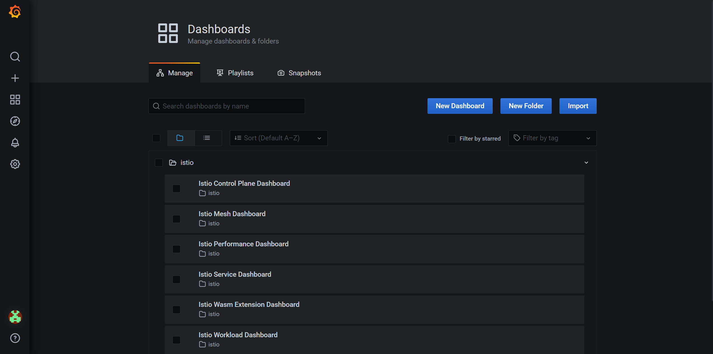
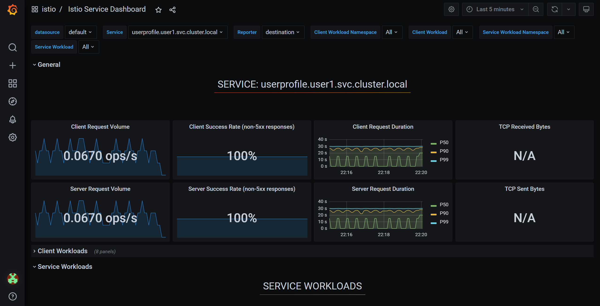

# Grafana를 사용한 서비스 메시 메트릭 확인

[Grafana][1]는 메트릭 관찰을 위해 Istio와 통합할 수 있는 모니터링 도구입니다. Grafana를 사용하여 메시의 서비스와 관련된 메트릭을 볼 수 있습니다. User profile 서비스에 대한 자세한 정보를 얻기 위해 Grafana를 사용합니다.

## Grafana 살펴보기

먼저 Grafana 사용자 인터페이스를 살펴보겠습니다.

<blockquote>
<i class="fa fa-terminal"></i>
Grafana 콘솔을 열기 위해 Grafana의 엔드포인트를 검색합니다.
</blockquote>

```execute
echo $(oc get route grafana -n %username%-istio --template='https://{{.spec.host}}')
```
<p><i class="fa fa-info-circle"></i> 접근 권한을 묻는 메시지가 표시되면 'Allow selected permissions'을 클릭합니다.</p>

<blockquote>
<i class="fa fa-desktop"></i>
새 브라우저 탭에서 이 URL로 이동합니다. 제공받은 OpenShift 유저 정보로 로그인합니다.
</blockquote>

로그인하면 Grafana 콘솔이 표시됩니다.


*Grafana Welcome*

<br>
<blockquote>
<i class="fa fa-desktop"></i>
왼쪽 바의 상단에서 세 번째 아이콘(대시보드) 위로 마우스를 가져간 다음 'Manage'를 선택합니다. 'istio' 폴더를 확장합니다.
</blockquote>

다음과 같이 표시되어야 합니다.

<br/>
*Grafana Istio 대시보드*

<br>
메트릭을 보기 전에 애플리케이션에 부하를 주어야 합니다.

<blockquote>
<i class="fa fa-terminal"></i>
애플리케이션 사용자 인터페이스에 부하를 줍니다.
</blockquote>

```execute
while true; do curl -s -o /dev/null $GATEWAY_URL; done
```

<br>

위 명령어가 실행되는 동안 몇 가지 대시보드를 살펴보겠습니다.

<blockquote>
<i class="fa fa-desktop"></i>
Grafana에서 'Istio Mesh Dashboard'를 선택합니다.
</blockquote>

다음과 같이 표시되어야 합니다.

<br/>
*Grafana Istio 메시 대시보드*

<br>

이 화면을 통해 서비스 및 해당 서비스와 관련된 메트릭을 전체적으로 볼 수 있습니다. 예를 들어, 전역적으로 오류 응답이 없음을 알 수 있으며 각 서비스의 처리량 및 대기 시간에 대한 빠른 스냅샷을 얻을 수 있습니다. 그러나 사용자 프로필 서비스에 대한 데이터가 누락되었으므로 해당 서비스에 약간의 부하를 주도록 하겠습니다.

<blockquote>
<i class="fa fa-terminal"></i>
터미널에서 다른 탭을 열고 사용자 프로필 서비스에 부하를 보냅니다.
(워크샵 화면의 오른쪽 위, 햄버거 버튼에서 'Open Terminal'을 통해 터미널을 새로운 브라우저 탭에서 열 수 있습니다.)
</blockquote>

```execute-2
GATEWAY_URL=$(oc get route istio-ingressgateway -n %username%-istio --template='http://{{.spec.host}}')
while true; do curl -s -o /dev/null $GATEWAY_URL/profile; done
```

메시 대시보드는 동적으로 업데이트 되기 때문에, 이제 다음과 같이 표시되어야 합니다.

<br/>
*Grafana Istio 메시 대시보드 업데이트됨*

<br>

userprofile 서비스에는 userprofile(버전 1)과 userprofile-2라는 두 가지 워크로드가 있습니다. userprofile-2에 대한 호출은 훨씬 느립니다. service 대시보드를 선택하여 서비스와 연결된 메트릭을 추가로 확인할 수 있습니다.

<blockquote>
<i class="fa fa-desktop"></i>
서비스 열(column)에서 userprofile 서비스 FQDN 위로 마우스를 가져간 다음 선택합니다.
</blockquote>

그러면 서비스 보기로 이동합니다. General 바를 클릭하면 아래와 같은 화면을 확인할 수 있습니다.

<br/>
*Grafana Istio 서비스 대시보드*

<br>

이는 사용자 프로필 서비스와 관련된 메트릭입니다. '서비스 워크로드'를 선택하면 해당 서비스에 대해 다양한 워크로드 버전이 어떻게 다른지 분석할 수 있습니다.

<blockquote>
<i class="fa fa-desktop"></i>
'Service Workloads'에서 Incoming Request Duration by Sourc(소스별 수신 요청 기간) 위로 마우스를 가져갑니다.
</blockquote>

그럼 다음과 같이 표시되어야 합니다.

<br/>
*Grafana Istio Service Dashboard - Request Duration*

<br>
이것은 메시 대시보드에서 봤던 대기 시간을 시각적으로 보여주며, 버전 2의 대기 시간이 훨씬 더 높다는 것을 확인할 수 있습니다.
<br>


[1]: https://grafana.com
