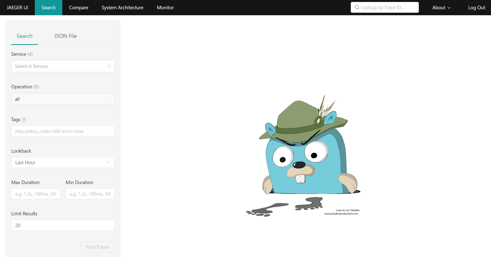

# Jaeger(예거)를 사용한 분산 추적

[Jaeger][1]는 서비스 메시를 통해 흐르는 요청을 추적할 수 있는 분산 추적 도구입니다. 이는 마이크로서비스 아키텍처의 성능 문제를 디버깅하는 데 매우 유용합니다.

## Jaeger 살펴보기

먼저 Jaeger 사용자 인터페이스를 살펴보겠습니다.

<blockquote>
<i class="fa fa-desktop"></i>
Jaeger 콘솔을 열기 위해 Jaeger에 대한 엔드포인트를 검색합니다.
</blockquote>

```execute
echo $(oc get route jaeger -n %username%-istio --template='https://{{.spec.host}}')
```

접근 권한을 묻는 메시지가 표시되면 'Allow selected permissions'을 클릭합니다.

> 새 브라우저 탭에서 이 URL로 이동합니다. 제공받은 OpenShift 유저 정보로 로그인합니다.

로그인하면 Jaeger 콘솔이 표시됩니다.

<br/>
*Jaeger Welcome*

<br>

메시에서 요청의 흐름을 관찰하려면 트레이스(traces)를 생성해야 합니다.

<blockquote>
<i class="fa fa-terminal"></i>
먼저 애플리케이션 사용자 인터페이스에 부하를 줍니다.
</blockquote>

```execute
for ((i=1;i<=100;i++)); do curl -s -o /dev/null $GATEWAY_URL; done
```

<br>
서비스에 대한 트레이스를 검사해 보겠습니다.

**Search** 아래의 왼쪽 바에서 'Service'는 `app-ui.%username%`를 선택하고, **Operation**에 대해서는 `boards-%username%.svc.cluster.local`를 선택합니다.

그럼 다음과 같이 표시되어야 합니다.

<br/>
*Boards 서비스에 대한 트레이스 검색*

<br>

<blockquote>
<i class="fa fa-desktop"></i>
'Find Traces' 버튼을 클릭하면 Jaeger가 Boards 서비스에 대한 트레이스를 다시 로드해야 합니다.
</blockquote>

<br/>
*Traces to Boards Service*

<br>

<blockquote>
<i class="fa fa-desktop"></i>
이 트레이스들 중에서 하나를 선택합니다.  
</blockquote>

정보에는 'Duration' 및 'Total Spans'가 포함됩니다. '지속 시간(Duration)'은 이 트레이스에 대한 응답을 보내고 받는 데 걸린 총 시간을 나타냅니다. '총 스팬(Total Spans)'는 스팬의 수를 나타냅니다. 각 '스팬'은 이 트레이스에 대해 실행된 작업 단위를 나타냅니다. 아래 예에서 'app-ui'는 9.52ms가 소요되었으며, 이 중 5.14ms는 보드 서비스를 호출하는 데 소요되었습니다. 보드 서비스 자체는 응답을 반환하기 전에 실행하는 데 3.56ms가 걸렸습니다.

<br/>
*Boards Service Example*

<br>
  
스팬 자체를 클릭하여 각 스팬에 대한 자세한 정보를 검사할 수 있습니다.

<blockquote>
<i class="fa fa-desktop"></i>
다음과 같이 트리에서 가장 낮은 두 스팬을 확장합니다.
</blockquote>

<br/>
*Boards Service 확장*

각 스팬은 전체 기간에 상대적인 스팬의 지속 시간과 시작 시간을 제공합니다. '태그' 아래에서 HTTP URL, 메소드, 응답 등의 추가 정보를 볼 수 있습니다. 마지막으로 이 스팬을 실행한 프로세스의 실제 IP를 볼 수 있습니다. IP가 이 트래픽을 제공한 파드와 일치하는지 확인할 수 있습니다.

<br>

<blockquote>
<i class="fa fa-terminal"></i>
app-ui 파드 IP를 확인합니다.
</blockquote>

```execute
oc get pods -l deploymentconfig=app-ui -o jsonpath='{.items[*].status.podIP}{"\n"}'
```

<blockquote>
<i class="fa fa-terminal"></i>
boards 파드 IP를 확인합니다.
</blockquote>

```execute
oc get pods -l deploymentconfig=boards -o jsonpath='{.items[*].status.podIP}{"\n"}'
```

파드 IP는 확장한 스팬의 프로세스 IP와 일치해야 합니다.

<br>

## User Profile 디버그

배운 내용을 사용하여 User Profile 서비스의 성능을 디버그해 보겠습니다.

<blockquote>
<i class="fa fa-terminal"></i>
user profile 서비스에 부하 주기
</blockquote>

```execute
for ((i=1;i<=5;i++)); do curl -s -o /dev/null $GATEWAY_URL/profile; done
```

<p><i class="fa fa-info-circle"></i> 프로필 서비스가 느리므로 이 작업이 완료될 때까지 기다리세요.</p>

<br>
이어서 트레이스를 검사합니다.
<br>

**Search** 아래의 왼쪽 바에서 'Service'는 `app-ui.%username%`를 선택하고, **Operation**에 대해서는 `userprofile-%username%.svc.cluster.local`를 선택합니다.
</blockquote>

<blockquote>
<i class="fa fa-desktop"></i>
'Find Traces' 버튼을 클릭하면 Jaeger가 user profile 서비스에 대한 트레이스를 다시 로드해야 합니다.
</blockquote>

<br/>
*Traces to User Profile Service*
 
이러한 트레이스 중 일부는 빠르며(ms 단위) 일부는 느립니다(약 10초).

<br>

<blockquote>
<i class="fa fa-desktop"></i>
Select one of the fast traces to start, and expand the lowest span.  
빠른 트레이스(ms 단위) 중 하나를 선택하고, 가장 낮은 스팬을 확장합니다.
</blockquote>

화면은 다음과 같아야 합니다.

<br/>
*User Profile Fast Service*

위의 예에서 트레이스를 완료하는 데 총 13.48ms가 소요되었습니다. user profile 서비스 자체는 실행하고 응답을 반환하는 데 3.5ms가 걸렸습니다. 이 요청을 처리한 파드가 버전 1 사용자 프로필 서비스인지 것을 확인할 수 있습니다.

<br>

<blockquote>
<i class="fa fa-terminal"></i>
userprofile-v1 파드 IP를 확인합니다.
</blockquote>

```execute
oc get pods -l deploymentconfig=userprofile,version=1.0 -o jsonpath='{.items[*].status.podIP}{"\n"}'
```

파드 IP는 확장한 스팬의 프로세스 IP와 일치해야 합니다.

<br>

<blockquote>
<i class="fa fa-desktop"></i>
이제 느린 트레이스(약 10s) 중 하나를 선택하고 가장 낮은 스팬을 확장합니다.
</blockquote>

화면은 다음과 같아야 합니다.

<br/>
*User Profile Slow Service*

이 보기에서 userprofile 서비스 자체에서 요청의 총 시간을 소비했음을 쉽게 확인할 수 있습니다. 위의 예에서는 5:23ms에 실행을 시작했고 완료하는 데 10초가 걸렸습니다. 이 요청을 처리한 파드가 버전 2 사용자 프로필 서비스인지 추가로 확인할 수 있습니다.

<br>

<blockquote>
<i class="fa fa-terminal"></i>
userprofile-v2 파드 IP를 확인하십시오.
</blockquote>

```execute
oc get pods -l deploymentconfig=userprofile,version=2.0 -o jsonpath='{.items[*].status.podIP}{"\n"}'
```

파드 IP는 확장한 범위의 프로세스 IP와 일치해야 합니다.

<br>

이 시점에서 버전 2 소스에 직접적인 성능 문제가 있음이 분명합니다. 예제는 단순했지만, 만약 메시에 복잡한 서비스 호출 네트워크가 있는 경우 분산 추적이 매우 유용합니다.

<br>


[1]: https://www.jaegertracing.io
