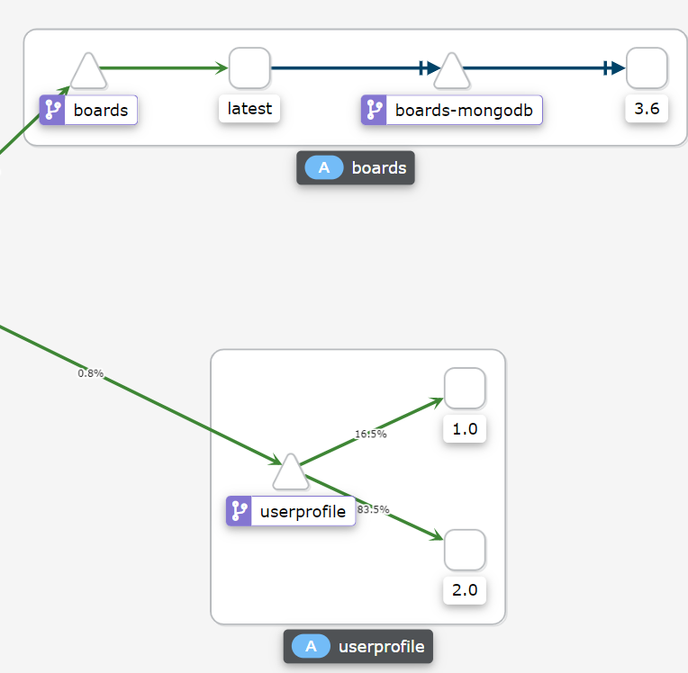
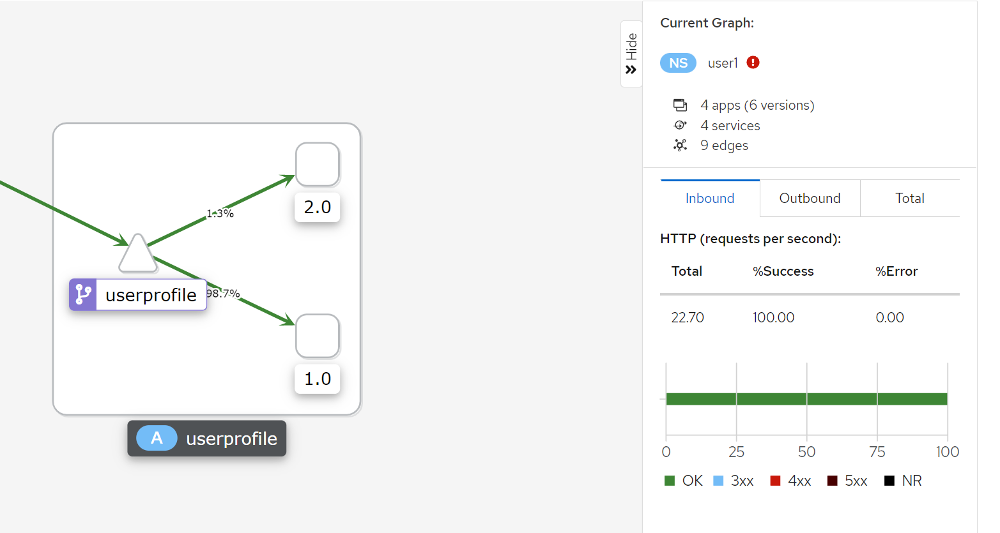

# 메시를 통한 트래픽 라우팅에 대한 기본 사항

Istio의 핵심 기능 중 하나는 애플리케이션 코드 자체를 수정하지 않고 서비스가 통신하는 방식을 동적으로 제어하는 기능입니다. Istio에서 이 개념을 [트래픽 관리][1]라고 합니다. A/B 테스트, 카나리아 롤아웃, 롤백 등과 같은 작업을 수행할 수 있습니다.

The two core API objects for traffic management are the [Virtual Service][2] and the [Destination Rule][3].  The destination rule is for the owner of a microservice - what versions do I expose and what happens to traffic before it reaches my service?  The virtual service is for the client of a microservice - how do I want to route traffic to the microservice?
트래픽 관리를 위한 두 가지 핵심 API 개체는 [Virtual Service(가상 서비스)][2]와 [Destination Rule(대상 규칙)][3]입니다. 
Destination Rule은 마이크로 서비스의 소유자를 위한 것입니다. 어떤 버전을 노출하고 트래픽이 내 서비스에 도달하기 전에 어떻게 할지 설정합니다. 
Virtual Service는 마이크로 서비스의 클라이언트를 위한 것입니다. 마이크로 서비스로 트래픽을 어떻게 라우팅할지 설정합니다.

예를 들어 Destination Rule은 두 가지 버전의 서비스(예: 'v1', 'v2')를 노출하고 각 버전에 대해 서로 다른 로드 밸런싱 정책을 규정할 수 있습니다. 그런 다음 Virtual Service는 클라이언트가 마이크로 서비스를 호출할 때 트래픽을 각 버전으로 분할할 수 있습니다.

## 트래픽 라우팅

트래픽 라우팅 규칙은 미리 구성되어 있습니다.

<blockquote>
<i class="fa fa-terminal"></i>
선호하는 편집기 또는 bash를 통해 Destination Rule을 봅니다.
</blockquote>

```execute
cat ./config/istio/destinationrules-all.yaml
```

Output (snippet):
```
...
apiVersion: networking.istio.io/v1alpha3
kind: DestinationRule
metadata:
  name: userprofile
spec:
  host: userprofile
  subsets:
  	- name: v1
  	  labels:
  	  	version: 1.0
      trafficPolicy:
        loadBalancer:
          simple: ROUND_ROBIN        
    - name: v2
      labels:
        version: 2.0
      trafficPolicy:
        loadBalancer:
          simple: RANDOM
...
```

대부분의 Destination Rule에는 tls 구성을 제외하고 특별한 구성이 없습니다. 이에 대해서는 이후 실습에서 설명합니다. 그러나 이 'userprofile' destination rule은 호출할 수 있는 서비스 버전을 'subsets(하위 집합)'으로 노출합니다. 출력된 내용을 확인하면, 버전 '1.0' 및 '2.0'에 대해 서로 다른 로드 밸런서 정책을 볼 수 있습니다. 기본적으로 Istio는 'ROUND_ROBIN' 로드 밸런싱을 사용합니다.

<blockquote>
<i class="fa fa-terminal"></i>
선호하는 편집기 또는 bash를 통해 Virtual Service를 봅니다.
</blockquote>

```execute
cat ./config/istio/virtual-services-all-v2.yaml
```

Output (snippet):
```
...
---
apiVersion: networking.istio.io/v1alpha3
kind: VirtualService
metadata:
  name: userprofile
spec:
  hosts:
  - userprofile
  http:
  - route:
    - destination:
        host: userprofile
        subset: v2
---
...
```

대부분의 Virtual Service에는 특별한 구성이 없습니다. 그러나 지금 보시는 'userprofile' virtual service는 특별히 'userprofile' 마이크로 서비스의 버전 'v2'로 라우팅합니다.

<blockquote>
<i class="fa fa-terminal"></i>
위에서 보신 라우팅 규칙을 배포해 보겠습니다.
</blockquote>

```execute
oc apply -f ./config/istio/destinationrules-all.yaml 
oc apply -f ./config/istio/virtual-services-all-v2.yaml
```

<blockquote>
<i class="fa fa-terminal"></i>
Destination Rule들을 확인합니다.
</blockquote>

```execute
oc get dr
```

Output:
```
NAME                     HOST                     AGE
app-ui                   app-ui                   24m
boards                   boards                   24m
boards-mongodb           boards-mongodb           24m
userprofile              userprofile              20m
userprofile-postgresql   userprofile-postgresql   16m
```

<blockquote>
<i class="fa fa-terminal"></i>
Virtual Service들을 확인합니다.
</blockquote>

```execute
oc get virtualservice
```

Output (sample):
```
NAME                     GATEWAYS                       HOSTS                      AGE
app-ui                                                  [app-ui]                   25m
boards                                                  [boards]                   25m
boards-mongodb                                          [boards-mongodb]           25m
context-scraper                                         [context-scraper]          25m
ingressgateway          ["ingressgateway"]              [*]                        44m
userprofile                                             [userprofile]              25m
userprofile-postgresql                                  [userprofile-postgresql]   25m
```

그럼 브라우저에서 애플리케이션 UI를 테스트해 봅시다.

<blockquote>
<i class="fa fa-desktop"></i>
헤더의 'Profile' 섹션으로 이동합니다.
  
</blockquote>

<p><i class="fa fa-info-circle"></i> URL을 잊어버린 경우 다음을 통해 검색할 수 있습니다.</p>

```execute
echo $GATEWAY_URL
```

이 시점에서는 변화가 없어야 합니다. 이전 실습에서 배포한 user profile 서비스 버전 2로 라우팅하고 있으며 속도가 정말 느립니다.
<br>

이것이 Kiali에서 어떻게 보이는지 봅시다.

<blockquote>
<i class="fa fa-terminal"></i>
user profile 서비스에 부하 주기
</blockquote>

```execute
for ((i=1;i<=5;i++)); do curl -s -o /dev/null $GATEWAY_URL/profile; done
```

<br>

<blockquote>
<i class="fa fa-desktop"></i>
Kiali 탭의 왼쪽 바에서 'Graph'로 이동합니다.
</blockquote>

<br>

<blockquote>
<i class="fa fa-desktop"></i>
'Versioned app graph' 보기로 전환하고 보기 범위를 'Last 1m'으로 변경합니다.  
</blockquote>

user profile 버전 '2.0'으로 트래픽이 흐르는 것을 볼 수 있습니다.

트래픽 흐름은 그래프에서 녹색으로 강조 표시됩니다.

<br/>
*Kiali Graph with v2 Routing*

<br>

## 트래픽 라우팅 변경

Istio의 장점 중 하나는 애플리케이션 코드를 수정하지 않고도 트래픽 라우팅을 변경할 수 있다는 것입니다. 프로필 서비스 버전 2에 성능 문제가 있으므로 버전 1로 롤백하겠습니다. Virtual Service 구성을 변경하기만 하면 됩니다.

<blockquote>
<i class="fa fa-terminal"></i>
선호하는 편집기 또는 bash를 통해 수정된 Virtual Service를 봅니다. 
</blockquote>

```execute
cat ./config/istio/virtual-service-userprofile-v1.yaml
```

Output:
```
apiVersion: networking.istio.io/v1alpha3
kind: VirtualService
metadata:
  name: userprofile
spec:
  hosts:
  - userprofile
  http:
  - route:
    - destination:
        host: userprofile
        subset: v1
```

이 구성에서는 Virtual Service의 'v1'로 라우팅합니다.

<blockquote>
<i class="fa fa-terminal"></i>
변경된 내용을 배포합니다.
</blockquote>

```execute
oc apply -f ./config/istio/virtual-service-userprofile-v1.yaml
```

<blockquote>
<i class="fa fa-terminal"></i>
변경 사항을 확인합니다.
</blockquote>

```execute
oc describe virtualservice userprofile
```

Output (snippet):
```
...
Spec:
  Hosts:
    userprofile
  Http:
    Route:
      Destination:
        Host:    userprofile
        Subset:  v1
Events:          <none>
```

<br>

<blockquote>
<i class="fa fa-desktop"></i>
애플리케이션 UI에서 헤더의 'Profile' 섹션으로 이동합니다.
</blockquote>

페이지가 빠르게 로드되고 user profile 서비스 버전 1로 다시 라우팅됩니다.

<br>

<blockquote>
<i class="fa fa-terminal"></i>
트래픽 생성을 위해 100개의 user profile 요청을 보냅니다.
</blockquote>

```execute
for ((i=1;i<=100;i++)); do curl -s -o /dev/null $GATEWAY_URL/profile; done
```

<blockquote>
<i class="fa fa-desktop"></i>
이제 Kiali에서 왼쪽 탐색 바의 'Graph'로 이동합니다.
</blockquote>

<blockquote>
<i class="fa fa-desktop"></i>
'Versioned app graph' 보기로 전환하고 보기 범위를 'Last 1m'으로 변경합니다.  

</blockquote>

user profile 버전 '1.0'으로 트래픽이 흐르는 것을 볼 수 있습니다.

트래픽 흐름은 그래프에서 녹색으로 강조 표시됩니다.

<br/>
*Kiali Graph with v1 Routing*

<br>

## Summary

축하합니다. Istio로 트래픽 라우팅을 구성했습니다!

몇 가지 주요 사항은 다음과 같습니다.

* 트래픽 관리를 위한 두 가지 핵심 API 개체는 Virtual Service 및 Destination Rule입니다.
* Virtual Service를 수정하여 호출하는 서비스 버전을 변경할 수 있습니다.
* Kiali는 트래픽이 메시에서 흐르는 동안 서비스 그래프 보기를 제공합니다

[1]: https://istio.io/docs/concepts/traffic-management
[2]: https://istio.io/docs/concepts/traffic-management/#virtual-services
[3]: https://istio.io/docs/concepts/traffic-management/#destination-rules
