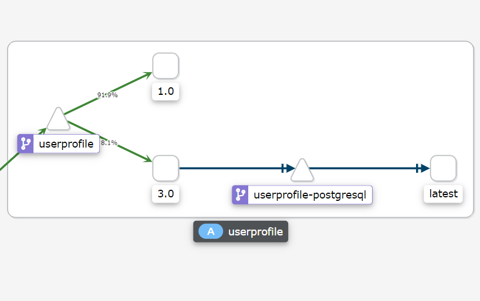
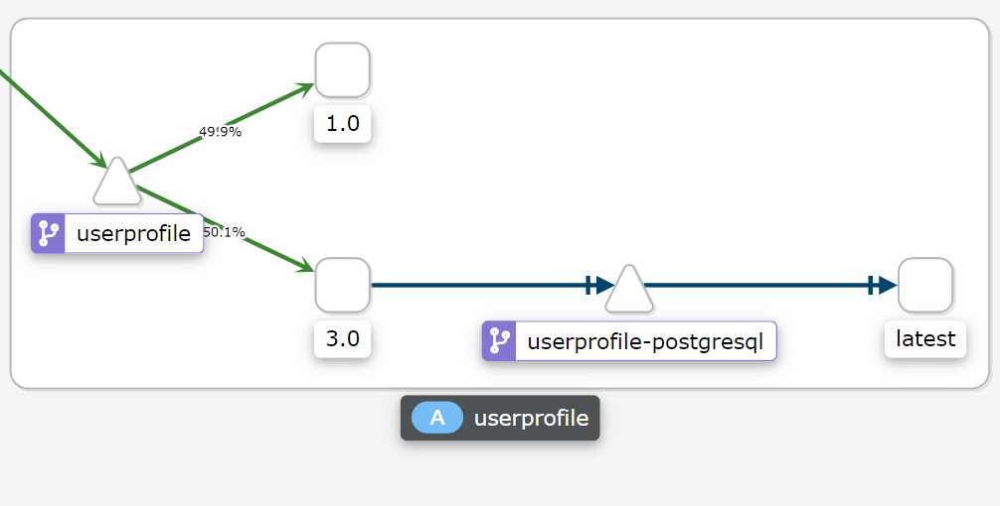
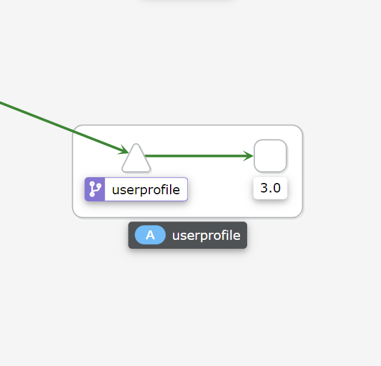

# 서비스 버전 간에 트래픽 분할

이제 애플리케이션의 성능 문제를 해결할 때입니다. 이전에는 애플리케이션의 새 버전을 배포하고 트래픽의 100%를 새 버전으로 라우팅했습니다. 이번에는 Istio 트래픽 라우팅을 사용하여 카나리아 롤아웃 및 트래픽 분할을 수행합니다.

## 기능 수정

user profile 서비스의 성능 문제를 수정하는 코드는 이미 'workshop-feature-fix' 분기에 작성되었습니다.

<blockquote>
<i class="fa fa-terminal"></i>
이 기능 fix 브랜치를 사용해서 새로운 빌드를 만듭니다.
</blockquote>

```execute
oc new-app -f ./config/app/userprofile-build.yaml \
  -p APPLICATION_NAME=userprofile \
  -p APPLICATION_CODE_URI=https://github.com/RedHatGov/service-mesh-workshop-code.git \
  -p APPLICATION_CODE_BRANCH=workshop-feature-fix \
  -p APP_VERSION_TAG=3.0
```

<p><i class="fa fa-info-circle"></i>'imagestream이 이미 존재한다'는 실패 메시지는 무시하면 됩니다.</p>

<blockquote>
<i class="fa fa-terminal"></i>
빌드 시작
</blockquote>

```execute
oc start-build userprofile-3.0 -F
```

빌드를 시작하면 빌더는 소스 코드를 컴파일하고 베이스 이미지를 사용해서 클러스터에 배포 가능한 이미지 아티팩트를 만듭니다. 기다리면 빌드가 성공적으로 완료됩니다.

Output (snippet):
```
...
[INFO] [io.quarkus.deployment.pkg.steps.JarResultBuildStep] Building thin jar: /tmp/src/target/userprofile-1.0-SNAPSHOT-runner.jar
[INFO] [io.quarkus.deployment.QuarkusAugmentor] Quarkus augmentation completed in 7988ms
[INFO] ------------------------------------------------------------------------
[INFO] BUILD SUCCESS
[INFO] ------------------------------------------------------------------------
[INFO] Total time:  01:41 min
[INFO] Finished at: 2020-02-24T19:13:59Z
[INFO] ------------------------------------------------------------------------...
```

빌드가 완료되면 이미지는 OpenShift 로컬 리포지토리에 저장됩니다.

<blockquote>
<i class="fa fa-terminal"></i>
이미지가 생성되었는지 확인합니다.
</blockquote>

```execute
oc describe is userprofile
```

Output (snippet):
```
...

3.0
  no spec tag

  * image-registry.openshift-image-registry.svc:5000/microservices-demo/userprofile@sha256:da74d277cc91c18226fb5cf8ca25d6bdbbf3f77a7480d0583f23023fb0d0d7df
      12 seconds ago

2.0
  no spec tag

  * image-registry.openshift-image-registry.svc:5000/microservices-demo/userprofile@sha256:147d836e9f7331a27b26723cbb99f2b667e176b4d5dd356fea947c7ca4fc24a6
      16 minutes ago
...
```

최신 이미지에는 '3.0' 태그가 있어야 합니다.

<blockquote>
<i class="fa fa-terminal"></i>
로컬 이미지에 대한 참조를 가져옵니다.
</blockquote>

```execute
USER_PROFILE_IMAGE_URI=$(oc get is userprofile --template='{{.status.dockerImageRepository}}')
echo $USER_PROFILE_IMAGE_URI
```

Output (sample):
```
image-registry.openshift-image-registry.svc:5000/microservices-demo/userprofile
```

Deployment 파일 'userprofile-deploy-v3.yaml'은 애플리케이션을 배포하기 위해 생성되었습니다.

<blockquote>
<i class="fa fa-terminal"></i>
이미지 URI를 사용하여 서비스를 배포합니다.
</blockquote>

```execute
sed "s|%USER_PROFILE_IMAGE_URI%|$USER_PROFILE_IMAGE_URI|" ./config/app/userprofile-deploy-v3.yaml | oc create -f -
```

<blockquote>
<i class="fa fa-terminal"></i>
user profile 서비스의 배포 상태 보기
</blockquote>

```execute
oc get pods -l deploymentconfig=userprofile --watch
```

Output:
```
userprofile-3-xxxxxxxxxx-xxxxx              2/2     Running        0          53s
userprofile-2-xxxxxxxxxx-xxxxx              2/2     Running        0          13m
userprofile-xxxxxxxxxx-xxxxx                2/2     Running        0          22h
```

<br>

## 트래픽 라우팅

user profile 서비스의 새 버전에 대한 [Canary 릴리스][1]부터 시작하겠습니다. 사용자 트래픽의 90%를 버전 1로 라우팅하고 트래픽의 10%를 최신 버전으로 라우팅합니다.

<blockquote>
<i class="fa fa-terminal"></i>
선호하는 편집기 또는 bash를 통해 Virtual Service를 봅니다.
</blockquote>

```execute
cat ./config/istio/virtual-service-userprofile-90-10.yaml
```

Output (snippet):
```
...
---
  http:
  - route:
    - destination:
        host: userprofile
        subset: v1
      weight: 90
    - destination:
        host: userprofile
        subset: v3
      weight: 10 
---
...
```

가중치(weight)는 서비스 하위 집합으로 전송되는 트래픽의 양을 결정합니다.

<blockquote>
<i class="fa fa-terminal"></i>
라우팅 규칙을 배포합니다.
</blockquote>

```execute
oc apply -f ./config/istio/virtual-service-userprofile-90-10.yaml
```

<blockquote>
<i class="fa fa-terminal"></i>
만약 Grafana 랩에서 수행했던 아래 명령이 지속되지 않고 있다면 - 다시 user profile 서비스에 지속적으로 로드를 보냅니다.
</blockquote>

```execute
while true; do curl -s -o /dev/null $GATEWAY_URL/profile; done
```

<br>

Kiali의 변경 사항을 확인합니다.
<blockquote>
<i class="fa fa-desktop"></i>
왼쪽 메뉴바에서 'Graph'로 이동합니다.
</blockquote>

<p><i class="fa fa-info-circle"></i> URL을 분실한 경우 다음을 통해 검색할 수 있습니다.</p>

`echo $KIALI_CONSOLE`

<blockquote>
<i class="fa fa-desktop"></i>
'Versioned app graph' 보기로 전환하고 보기 범위를 'Last 1m'으로 변경합니다. 
</blockquote>
<blockquote>
<i class="fa fa-desktop"></i>
드롭다운에서 엣지 레이블을 'No edge labels'에서 'Request Distribution'으로 변경합니다.  
</blockquote>

트래픽은 user profile 서비스 버전 1과 3 사이에서 대략 90%와 10%로 나뉩니다.

<br/>
*Kiali Graph with 90-10 Traffic Split*

이렇게 하면 모든 사용자에게 한 번에 영향을 주지 않고, 새 user profile 환경을 소규모 사용자에게만 한정시킬 수 있습니다.

변경 사항이 괜찮다고 생각되면 최신 버전에 대한 트래픽 부하를 늘릴 수 있습니다.

<blockquote>
<i class="fa fa-terminal"></i>
선호하는 편집기 또는 bash를 통해 Virtual Service를 확인합니다.
</blockquote>

```execute
cat ./config/istio/virtual-service-userprofile-50-50.yaml
```

Output (snippet):
```
...
---
  http:
  - route:
    - destination:
        host: userprofile
        subset: v1
      weight: 50
    - destination:
        host: userprofile
        subset: v3
      weight: 50
---
...
```

이 예에서는 두 버전 간에 트래픽을 균등하게 라우팅합니다. 이것은 A/B 테스트와 같은 고급 배포에 사용할 수 있는 기술입니다.

<blockquote>
<i class="fa fa-terminal"></i>
라우팅 규칙을 배포합니다.
</blockquote>

```execute
oc apply -f ./config/istio/virtual-service-userprofile-50-50.yaml
```

<blockquote>
<i class="fa fa-terminal"></i>
아직 실행 하지 않은 경우 - 아래와 같이 user profile 서비스에 로드를 보냅니다.
</blockquote>

```execute
while true; do curl -s -o /dev/null $GATEWAY_URL/profile; done
```

<br>

Kiali에서 변경 사항을 다시 확인하십시오.

<blockquote>
<i class="fa fa-desktop"></i>
왼쪽 메뉴바에서 'Graph'로 이동합니다.
</blockquote>
<blockquote>
<i class="fa fa-desktop"></i>
'Versioned app graph' 보기로 전환하고 엣지 레이블을 'No edge labels'에서 'Request Distribution'으로 변경합니다.  
</blockquote>

user profile 서비스 버전 1과 3 사이에 트래픽이 대략 50/50 비율로 분할된 것을 볼 수 있습니다.

<br/>
*Kiali Graph with 50-50 Traffic Split*

마지막으로 이 새 버전을 모든 사람에게 배포할 준비가 되었다고 합시다.

<br>

<blockquote>
<i class="fa fa-terminal"></i>
선호하는 편집기 또는 bash를 통해 Virtual Service를 확인합니다.
</blockquote>

```execute
cat ./config/istio/virtual-service-userprofile-v3.yaml
```

Output (snippet):
```
...
---
  http:
  - route:
    - destination:
        host: userprofile
        subset: v3
---
...
```

<blockquote>
<i class="fa fa-terminal"></i>
라우팅 규칙을 배포합니다.
</blockquote>

```execute
oc apply -f ./config/istio/virtual-service-userprofile-v3.yaml
```

<blockquote>
<i class="fa fa-terminal"></i>
아직 실행 하지 않은 경우 - 아래와 같이 user profile 서비스에 로드를 보냅니다.
</blockquote>

```execute
while true; do curl -s -o /dev/null $GATEWAY_URL/profile; done
```

<br>

Kiali에서 변경 사항을 다시 확인합니다.
<blockquote>
<i class="fa fa-desktop"></i>
왼쪽 메뉴바에서 'Graph'로 이동합니다.
</blockquote>
<blockquote>
<i class="fa fa-desktop"></i>
'Versioned app graph' 보기로 전환하고 엣지 레이블을 'No edge labels'에서 'Request Distribution'으로 변경합니다.  
</blockquote>


You should see traffic routed to v3 of the user profile service.
user profile 서비스의 v3으로 트래픽이 모두 라우팅 되는 것을 확인할 수 있습니다.

<br/>
*Kiali Graph with v3 Routing*

<br>

브라우저에서 이 버전의 프로필 서비스를 테스트해 보겠습니다.

<blockquote>
<i class="fa fa-desktop"></i>
헤더의 'Profile' 섹션으로 이동합니다.
</blockquote>

<p><i class="fa fa-info-circle"></i> URL을 분실한 경우 다음을 통해 검색할 수 있습니다.</p>

```execute
echo $GATEWAY_URL
```

<br>

다음과 같은 화면이 표시되어야 합니다.

<br/>
 *Profile Page*

<br>

## Summary

축하합니다. Istio에서 트래픽을 분할했습니다!

몇 가지 주요 사항은 다음과 같습니다.

A few key highlights are:

* Virtual Service에서 'weight(가중치)' 매개변수를 수정하여 다른 버전의 서비스로 전송되는 트래픽의 비율을 변경할 수 있습니다.
* Kiali 서비스 그래프는 트래픽이 메시에서 흐를 때 동적으로 변하는 트래픽 분할을 포착합니다.

[1]: https://martinfowler.com/bliki/CanaryRelease.html
[2]: https://martinfowler.com/bliki/BlueGreenDeployment.html
