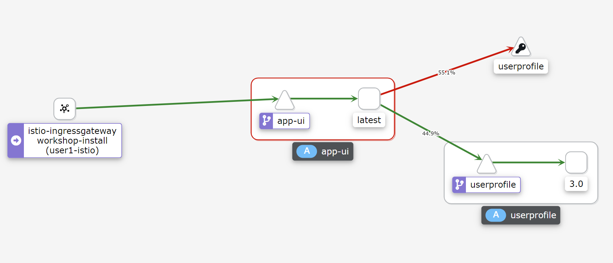

# 결함 주입으로 복원력 테스트

귀하의 애플리케이션은 이제 새 버전의 user profile 서비스로 훌륭하게 작동합니다. 그러나 이전 버전은 성능 문제를 일으켰고 향후 업데이트는 애플리케이션의 다른 영역에서 문제를 일으킬 수 있습니다. 오류가 발생했을 때 애플리케이션이 어떻게 작동하는지 어떻게 테스트할 수 있습니까?

서비스 메시에서 실패를 시뮬레이션할 방법이 필요합니다. 이렇게 하면 성능이 저하된 상태에서 애플리케이션이 올바르게 작동하는지 테스트할 수 있습니다. 이 개념은 일반적으로 [Chaos Engineering][1]으로 알려져 있습니다. Chaos Engineering에서는 프로덕션 환경에서 고장을 일으켜 소프트웨어를 테스트합니다.

Istio는 가상 서비스를 사용하여 [지연 오류(Delay Faults)][2] 및 [중단 오류(Abort Faults)][3]를 애플리케이션 계층에 장애로 주입하는 방법을 제공합니다. 이것을 paste board 애플리케이션으로 시도해 봅시다.


## 중단 오류

<blockquote>
<i class="fa fa-terminal"></i>
선호하는 편집기 또는 bash를 통해 Virtual Service를 확인합니다.
</blockquote>

```execute
cat ./config/istio/virtual-service-userprofile-503.yaml
```

Output (snippet):
```yaml
...
  http:
  - fault:
      abort:
        httpStatus: 503
        percent: 50
    route:
    - destination:
        host: userprofile
        subset: v3
...
```

이 구성은 user profile 서비스로 전송되는 트래픽의 50%에 503 오류를 삽입하도록 Istio에 지시합니다.

<blockquote>
<i class="fa fa-terminal"></i>
라우팅 규칙을 배포합니다.
</blockquote>

```execute
oc apply -f ./config/istio/virtual-service-userprofile-503.yaml
```

<blockquote>
<i class="fa fa-terminal"></i>
아직 수행하지 않은 경우(이전 실습에서) - 사용자 프로필 서비스에 로드를 보냅니다.
</blockquote>

```execute
while true; do curl -s -o /dev/null $GATEWAY_URL/profile; done
```

<br>

Kiali의 변경 사항을 확인합니다.
<blockquote>
<i class="fa fa-desktop"></i>
왼쪽 메뉴바에서 'Graph'로 이동합니다.
</blockquote>

<blockquote>
<i class="fa fa-desktop"></i>
'Versioned app graph' 보기로 전환하고 보기 범위를 'Last 1m'으로 변경합니다.
</blockquote>
<blockquote>
<i class="fa fa-desktop"></i>
드롭다운에서 엣지 레이블을 'No edge labels'에서 'Request Distribution'으로 변경합니다.
</blockquote>

<blockquote>
<i class="fa fa-desktop"></i>
'app-ui'(사각형)와 'userprofile' 서비스(삼각형) 사이의 빨간색 연결선을 클릭합니다.
</blockquote>

HTTP 오류로 요청의 약 50%가 반환된 것이 표시되어야 합니다.

<br/>
*Kiali Graph with abort faults*

브라우저에서 애플리케이션을 테스트해 보겠습니다.

<blockquote>
<i class="fa fa-desktop"></i>
헤더의 'Profile' 섹션으로 이동합니다.
</blockquote>

<p><i class="fa fa-info-circle"></i> URL을 분실한 경우 다음을 통해 검색할 수 있습니다.</p>

```execute
echo $GATEWAY_URL
```

<blockquote>
<i class="fa fa-desktop"></i>
브라우저를 몇 번 새로 고칩니다.  
</blockquote>

때로는 프로필 페이지가 표시됩니다. 어떤 때에는 'Unknown User'가 표시됩니다.

중단 오류를 주입하는 것은 애플리케이션이 실패를 처리하는 방법을 테스트하는 훌륭한 메커니즘입니다. 더 복잡한 서비스 메시에서는 이를 사용하여 오류 발생 서비스로 인해 다른 서비스 체인이 실패하는 연쇄 실패를 식별하고 방지할 수 있습니다.

<br>

## 지연 오류

user profile 서비스 버전 2에 성능 문제가 있습니다. Istio에서 지연 오류를 사용하여 이 시나리오를 종합적으로 시뮬레이션할 수 있습니다.

<blockquote>
<i class="fa fa-terminal"></i>
선호하는 편집기 또는 bash를 통해 Virtual Service를 확인합니다.
</blockquote>

```execute
cat ./config/istio/virtual-service-userprofile-delay.yaml
```

Output (snippet):
```yaml
...
  http:
  - fault:
      delay:
        fixedDelay: 5s
        percent: 50
    route:
    - destination:
        host: userprofile
        subset: v3
...
```

이 구성은 user profile 서비스로 전송되는 트래픽의 50%에 5초 지연을 삽입하도록 Istio에 지시합니다.

<blockquote>
<i class="fa fa-terminal"></i>
라우팅 규칙을 배포합니다.
</blockquote>

```execute
oc apply -f ./config/istio/virtual-service-userprofile-delay.yaml
```

<blockquote>
<i class="fa fa-terminal"></i>
아직 수행하지 않은 경우 - 사용자 프로필 서비스에 부하 주기
</blockquote>

```execute
while true; do curl -s -o /dev/null $GATEWAY_URL/profile; done
```

<br>

<blockquote>
<i class="fa fa-desktop"></i>
Jaeger에서 트레이스(트래픽 추적)를 살펴보겠습니다.
</blockquote>

Jaeger 탭을 열고, **Service**를 `userprofile.%username%`으로 설정하고 **Find Traces**를 클릭 합니다.

일부 트레이스는 지속 시간이 약 5초이고 다른 트레이스는 밀리초 범위에 있습니다.

지연 오류를 주입하는 것은 애플리케이션이 느린 아웃바운드 서비스 호출을 처리하는 방법을 테스트하는 훌륭한 메커니즘입니다.


<br/>
*오류 지연이 있는 User Profile Service에 대한 트레이스*

## Clean up

<blockquote>
<i class="fa fa-terminal"></i>
이 실습을 종료하기 전에 변경한 사항을 되돌립니다.
</blockquote>

```execute
oc apply -f ./config/istio/virtual-service-userprofile-v3.yaml
```

<br>

## Summary

축하합니다. Istio로 결함 주입을 구성했습니다!

몇 가지 주요 사항은 다음과 같습니다.

* 지연 오류 및 중단 오류를 사용하여 서비스 메시의 탄력성을 테스트할 수 있습니다.
* 중단 오류는 서비스 호출에 대한 응답으로 50x 오류를 종합적으로 주입합니다.
* 지연 오류는 서비스 호출에 대한 응답에서 종합적으로 지연을 추가합니다.
* Jaeger는 분산 추적으로 성능 지연을 할 수 있습니다.

[1]: https://en.wikipedia.org/wiki/Chaos_engineering
[2]: https://istio.io/docs/tasks/traffic-management/fault-injection/#injecting-an-http-delay-fault
[3]: https://istio.io/docs/tasks/traffic-management/fault-injection/#injecting-an-http-abort-fault
