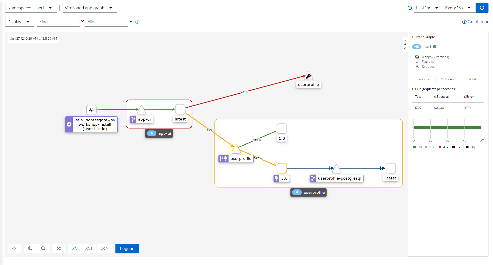

#  서비스 회로 차단(Circuit Breaking)

오류 주입(Fault Injection)을 사용하면 특정 서비스에 대한 네트워크 호출에 장애가 있을 때 서비스 메시가 어떻게 작동하는지 확인할 수 있습니다. 그러나 트래픽을 제공하는 인스턴스에 과부하가 걸리거나 실패한 경우에는 서비스를 어떻게 보호합니까? 이상적으로는 장애가 있는 인스턴스를 식별하고 특정 임계값을 충족하면 클라이언트가 해당 인스턴스에 연결하지 못하도록 하는 것이 좋습니다.

OpenShift에서 '인스턴스'는 마이크로서비스를 실행하는 Kubernetes 파드라고 생각할 수 있습니다. 

이 개념을 회로 차단(Circuit Breaking)이라고 합니다. 마이크로 서비스를 실행하는 인스턴스에 대한 임계값 제한(Threshold Limits)을 설정하고, 임계값 제한에 도달하면 회로 차단기가 작동하여 Istio가 해당 인스턴스에 대한 추가 연결을 방지합니다. 회로 차단은 서비스 메시에서 탄력적인 서비스를 구축하는 또 다른 방법입니다.

Istio에서는 Destination Rule을 사용하여 회로 차단 제한을 정의할 수 있습니다.

## 임계값 제한 정의

user profile 서비스에 대한 회로 차단 규칙은 이미 작성되었습니다.

<blockquote>
<i class="fa fa-terminal"></i>
선호하는 편집기 또는 bash를 통해 Destination Rule를 확인합니다.
</blockquote>

```execute
cat ./config/istio/destinationrule-circuitbreaking.yaml
```

Output (snippet):
```
...
  trafficPolicy:
    tls:
      mode: ISTIO_MUTUAL
    connectionPool:
      http:
        http1MaxPendingRequests: 1
        maxRequestsPerConnection: 1
    outlierDetection:
      consecutiveErrors: 1
      interval: 1s
      baseEjectionTime: 10m
      maxEjectionPercent: 100
...
```

회로 차단 규칙은 user profile 서비스 v3에만 적용됩니다. 위의 커넥션 풀(connectionPool) 설정은 각 인스턴스에 대한 최대 요청 수를 1로 제한합니다(이렇게 하면 테스트 상황에서 회로 차단을 더 빨리 작동시킬 수 있습니다). 이상값 감지(outlierDetection) 설정은 임계값을 정의합니다. 50x 오류로 한 번 실패한 인스턴스는 10분 동안 메시에서 제거됩니다. Istio [문서][1]에서 다양한 설정에 대해 읽을 수 있습니다.

<blockquote>
<i class="fa fa-terminal"></i>
그럼 이 회로 차단 규칙을 배포합니다.
</blockquote>

```execute
oc apply -f ./config/istio/destinationrule-circuitbreaking.yaml
```

<br>

## 회로 차단기 트립

<blockquote>
<i class="fa fa-terminal"></i>
먼저 user profile 서비스의 v1과 v3 간에 트래픽을 균등하게 라우팅합니다.
</blockquote>

```execute
oc apply -f ./config/istio/virtual-service-userprofile-50-50.yaml
```

<blockquote>
<i class="fa fa-terminal"></i>
user profile 서비스에 부하 주기
</blockquote>

```execute
while true; do curl -s -o /dev/null $GATEWAY_URL/profile; done
```

<blockquote>
<i class="fa fa-terminal"></i>
터미널의 다른 탭에서 user profile 서비스 버전 3을 실행하는 서버를 종료합니다.
</blockquote>

```execute-2
USERPROFILE_POD=$(oc get pod -l deploymentconfig=userprofile,version=3.0 -o jsonpath='{.items[0].metadata.name}')
oc exec $USERPROFILE_POD -- kill 1
```

<br>

Kiali의 변경 사항을 확인합니다.
<blockquote>
<i class="fa fa-desktop"></i>
왼쪽 메뉴바에서 'Graph'로 이동합니다.
</blockquote>

<blockquote>
<i class="fa fa-desktop"></i>
'Versioned app graph' 보기로 전환하고 보기 범위를 'Last 1m'으로 변경합니다. 엣지 레이블을 'No edge labels'에서 'Request Distribution'으로 변경합니다.
</blockquote>

<br/>
*오류 지연이 있는 User Profile Service에 대한 추적*

트래픽의 비율이 점차적으로 v3에서 v1로 변하는 것을 확인할 수 있습니다. 번개 아이콘은 회로 차단 규칙이 있음을 나타내며, 실패한 요청에 대해 회로 차단기가 작동하여 트래픽이 v1으로 라우팅되었습니다.

그러나 OpenShift는 상태 확인(health check)이 실패하면 서버(이 경우 파드)를 되살리려고 시도합니다. 트래픽 재조정의 기미가 보이면 위의 명령을 실행하여 서버를 다시 종료하십시오.

<br>

## Clean up

<blockquote>
<i class="fa fa-terminal"></i>
이 실습을 종료하기 전에 변경한 사항을 되돌립니다.
</blockquote>

```execute
oc apply -f ./config/istio/destinationrules-all.yaml
oc apply -f ./config/istio/virtual-services-default.yaml
```

<br>

## Summary

축하합니다. Istio에서 회로 차단 기능을 구성했습니다!

몇 가지 주요 사항은 다음과 같습니다.

* 회로 차단은 비정상 서비스 인스턴스에 대한 연결을 차단하여 서비스 메시에서 탄력성을 구현할 수 있습니다.
* 회로 차단 작동에 대한 임계값 제한은 Destination Rule에서 설정할 수 있습니다.

[1]: https://istio.io/docs/reference/config/networking/destination-rule/#OutlierDetection
