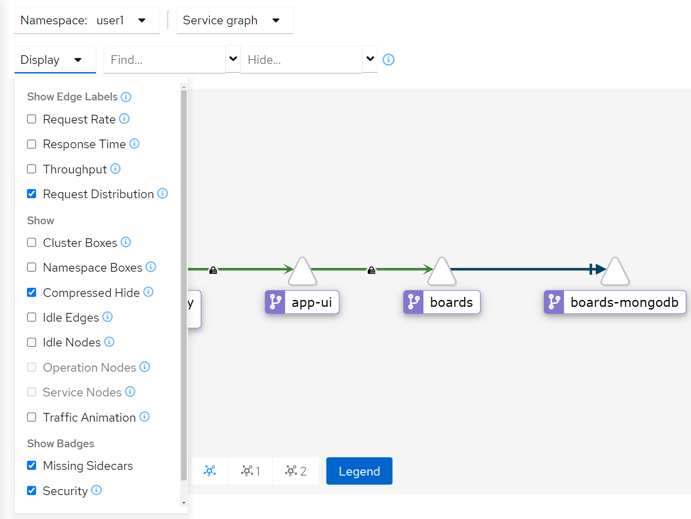
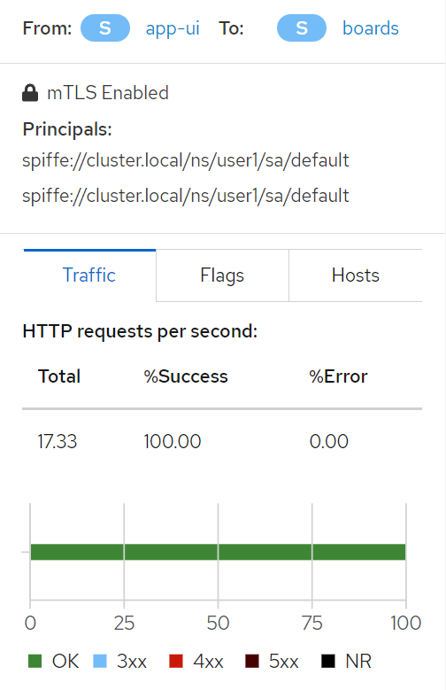

# mTLS 확인 및 검증
이제 모든 서비스가 트래픽을 암호화하고 있습니다. 이제 Kiali에서 암호화 설정을 살펴보겠습니다.

<blockquote>
<i class="fa fa-desktop"></i>
Kiali의 변경 사항을 확인합니다. 왼쪽 메뉴바에서 'Graph'로 이동합니다.
<br>
윗줄 두번째 드롭다운(아마 'Versioned app graph'가 선택되어 있을)에서 'Service graph'를 선택하고 'Display' 드롭다운 맨 아래쪽의 'Security' 란이 선택되어 있는지 확인합니다.
</blockquote>

서비스 간 통신을 위해 mTLS가 작동 중임을 나타내는 작은 자물쇠 아이콘이 있는, 아래 스크린샷과 같은 화면을 볼 수 있습니다.

<br/>
<br>

<blockquote>
<i class="fa fa-desktop"></i>
app-ui와 board 서비스를 연결하는 라인을 클릭합니다.
</blockquote>

연결 세부 정보 보기에도 mTLS가 표시됩니다.

<br/>
<br>
<br>

<blockquote>
<i class="fa fa-terminal"></i>
그럼 트래픽을 스누핑하기 위해 동일한 명령을 다시 실행해 보겠습니다. 다음 명령을 실행합니다.
</blockquote>

```execute
curl boards.%username%:8080/shareditems | jq
```

작업이 데이터를 가져오지 못했다는 출력을 받아야 합니다. 이는 트래픽이 메시에 알려진 검증 가능한 서비스에서 발생하지 않았고, 보안 mTLS 토큰 핸드셰이크를 수행할 수 없었기 때문입니다. 출력은 다음과 같습니다.

```
curl: (56) Recv failure: Connection reset by peer
```

## Strict 모드 끄기
strict 모드를 다시 끄도록 합니다. 다음 몇 개의 랩에서는 의도적으로 안전하지 않은 작업을 수행할 것입니다.

<blockquote>
<i class="fa fa-terminal"></i>
CLI에 다음을 입력합니다.
</blockquote>

```execute
oc delete peerauthentication/default
oc delete dr --all
```


## mTLS 옵션에 대한 추가 정보

서비스 메시의 mTLS는 단순히 ON/OFF 기능이 아닙니다. 실습에서는 mTLS를 기본적으로 적용했지만, 필요한 경우에는 적용할 특정 서비스를 선택할 수 있습니다. PERMITICE 모드는 기존 서비스의 트래픽을 일반 텍스트에서 mTLS로 마이그레이션하려는 시나리오에서 특히 유용합니다. 이를 통해 서비스는 라이브 트래픽을 중단하지 않고 일반 텍스트 트래픽과 상호 TLS 트래픽을 동시에 수신할 수 있습니다.

[기존 루트 인증서, 서명 인증서 및 키][2]를 사용하여 서비스 메시를 구성할 수도 있습니다. [여기 개요][1] 및 [인증 정책 섹션][3]에 대한 추가 보안 구성을 읽어 보시길 바랍니다.


## 요약 및 아키텍처 검토

모두 활용하기 쉬운 것 같죠? 어떻게 작동하는지 조금 파헤쳐 보겠습니다.

먼저 사이드카와 경계 프록시는 PEP(Policy Enforcement Points, 정책 적용 지점)역할을 하며 메시 외부와 메시의 서비스 간(모든 클라이언트/서버 연결)의 통신을 보호합니다. 그리고 Service Mesh 컨트롤 플레인은 설정, 인증서 및 키를 관리합니다. 단순화된 아키텍처는 다음과 같습니다.

<br/>

Service Mesh의 데이터 플레인은 각 Enjoy 사이드카 컨테이너에 구현되는 PEP를 통해 서비스 대 서비스 통신을 터널링합니다. 워크로드가 상호 TLS 인증을 사용하여 요청을 다른 워크로드로 보낼 때 요청은 다음과 같이 처리됩니다.

* 아웃바운드 트래픽은 서비스 A와 동일한 파드에서 실행되는 로컬 사이드카 Envoy로 다시 라우팅됩니다.
* 클라이언트 측 Envoy는 서비스 B의 서버 측 Envoy와 상호 TLS 핸드셰이크를 시작합니다. 핸드셰이크가 진행되는 동안 클라이언트 측 Envoy는 보안 명명 검사를 수행하여 서버 인증서에 표시된 서비스 계정이 대상 서비스를 실행할 권한이 있는지 확인합니다.
* 클라이언트 측 Envoy와 서버 측 Envoy는 상호 TLS 연결을 설정하고 트래픽은 클라이언트 측 Envoy에서 서버 측 Envoy로 전달됩니다.
* 인증 후 서버 측 Envoy는 로컬 TCP 연결을 통해 트래픽을 서비스 B로 전달합니다.

<p>
<i class="fa fa-info-circle"></i>
이 모든 것은 YAML을 통해 구성할 수 있으며(컨트롤 플레인은 Envoy 사이드카를 업데이트함) 서비스를 다시 빌드하거나 다시 배포할 필요가 없습니다.
</p>


## mTLS 요약
* 각 서비스에 강력한 ID 제공
* 키 및 인증서 생성, 배포 및 교체를 자동화하는 키 관리 시스템 제공
* 서비스 간 통신 보호

이 모든 것을 작동시키기 위한 아키텍처는 다소 복잡합니다. 세부 정보를 자세히 알아보려면 이 [보안 개요 페이지][1]를 확인하는 것이 가장 좋습니다.

보안에 대해 자주 묻는 질문은 이 [페이지][4]에서 확인하십시오.

[1]: https://istio.io/docs/concepts/security/
[2]: https://istio.io/docs/tasks/security/plugin-ca-cert/
[3]: https://istio.io/docs/concepts/security/#authentication-policies
[4]: https://istio.io/faq/security/
