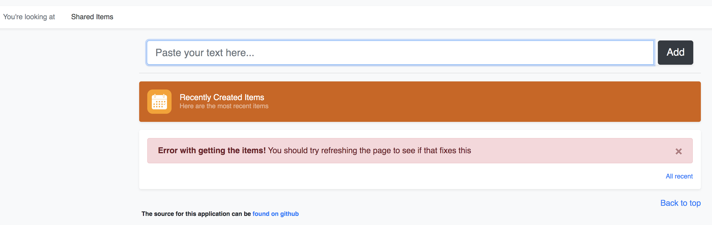

# 정책을 통한 접근 권한 부여 및 인증

이전 실습에서 서비스 간 통신을 보호하고 확인했습니다. 그러나 사용자 대 서비스 통신(일명 origin 인증)은 어떨까요? 서비스 메시도 여기에 도움이 될 수 있습니다. 이를 위해 로그인한 사용자에게 JSON 웹 토큰(JWT)을 발급할 ID 공급자를 불러와야 합니다. JWT는 ID를 공유하는 개방형 산업 표준(RFC 7519) 방식입니다. app-ui 서비스는 API 요청과 함께 이러한 JWT를 전달합니다. 이를 통해 서비스 메시의 사이드카 프록시가 역할 데이터를 확인하고, 가져오고, 액세스를 적용할 수 있습니다.

인증 및 권한 부여 정책을 통해 서비스 접근을 제한하는 기본적인 예시를 살펴보겠습니다.


## 인증된 사용자만
우리는 서비스를 완전히 잠그고 인증된 사용자만 접속하도록 할 수 있습니다.

<blockquote>
<i class="fa fa-terminal"></i> 다음 명령을 사용하여 새 인증 정책 및 서비스 항목을 적용합니다.
</blockquote>

```execute
 sed "s|%SSO_SVC%|$SSO_SVC|" ./config/istio/request-authentication-boards-jwt.yaml | oc apply -f -
 sed "s|%SSO_SVC%|$SSO_SVC|" ./config/istio/serviceentry-keycloak.yaml | oc apply -f -
```

이 정책은 아래와 같이 boards 서비스에 대한 트래픽이 특정 속성을 가진 JWT를 보유하기 위한 요구 사항을 지정합니다. 
```yaml
apiVersion: "security.istio.io/v1beta1"
kind: RequestAuthentication
metadata:
  name: "boards-jwt"
spec:
  selector:
    matchLabels:
      app: boards
      deploymentconfig: boards
  jwtRules:
  - issuer: "https://keycloak-sso-shared.apps.cluster.domain.com/auth/realms/microservices-demo"
    jwksUri: "https://keycloak-sso-shared.apps.cluster.domain.com/auth/realms/microservices-demo/protocol/openid-connect/certs"

```
<p>
<i class="fa fa-info-circle"></i>
우리는 앞서 JWT가 ID 정보를 공유한다고 언급했고, JWKS 엔드포인트는 JWT의 데이터가 신뢰할 수 있는 소스에서 나온 것인지 확인할 수 있는 키를 제공합니다.
</p>

<p>
<i class="fa fa-info-circle"></i>
함께 배포한 service entry에 대해서는 다음 실습에서 설명하기로 하고, 넘어가겠습니다.
</p>


<br>

<blockquote>
<i class="fa fa-desktop"></i> 웹 앱으로 이동하여 화면 상단의 Shared 버튼을 클릭합니다.
</blockquote>

정책이 잘 적용되었다면 다음 오류와 함께 실패합니다.

<br/>

<br>

<blockquote>
<i class="fa fa-desktop"></i> 비밀번호 "demo"를 사용하여 "demo" 유저로 로그인 합니다.
</blockquote>

<blockquote>
<i class="fa fa-desktop"></i> 페이지에 다시 접근해 보세요.
</blockquote>

이제 shared itme 목록이 표시됩니다.

<br/>


<p><i class="fa fa-info-circle"></i>
적용되기 전에 페이지를 몇 번 새로고침해야 할 수 있습니다.
</p>


<br>
<br>

## Cool Kids만!
이 시나리오에서는 특정 사용자 그룹만 게시할 수 있도록 shared 보드 목록에 대한 액세스를 더욱 안전하게 보호하려고 합니다. 그리고 우리는 이 작업을 순수하게 Service Mesh 구성을 통해 수행할 것입니다. 하는 것은 매우 간단합니다.

<blockquote>
<i class="fa fa-terminal"></i> 다음 명령을 사용하여 권한 부여 정책을 적용합니다.
</blockquote>

```execute
oc create -f ./config/istio/authorization-boards-shared-lockdown.yaml
```

해당 구성은 다음과 같습니다.
```yaml
apiVersion: security.istio.io/v1beta1
kind: AuthorizationPolicy
metadata:
  name: boards-shared-lockdown
spec:
  selector:
    matchLabels:
      app: boards
      deploymentconfig: boards
  rules:
  - from:
    - source:
        requestPrincipals: ["*"]
    to:
    - operation:
        methods: ["POST"]
        paths: ["*/shareditems"]
    when:
    - key: request.auth.claims[realm_access_roles]
      values: ["cool-kids"]
  - from:
    - source:
        requestPrincipals: ["*"]
    to:
    - operation:
        methods: ["GET"]
    when:
    - key: request.auth.claims[scope]
      values: ["openid"]
```

권한 부여 정책(authorization policy)에는 selector 및 규칙 목록이 포함됩니다. selector는 정책이 적용되는 **대상**을 지정합니다(이 경우에는 boards 마이크로 서비스). 
규칙은 **누가**(from)가 **어떤**(when) 조건에서 **무엇**(to do)을 할 수 있는지 명시하지만, 이 경우 JWT 페이로드에 "cool-kids" 역할이 나열되어 있는 한 모든 소스는 POST를 할 수 있습니다.

자, 이제 정책을 적용했으니, 여러분이 cool-kids 클럽에 있지 않을 때 게시판 서비스에 접속해 보겠습니다.

<br>

<blockquote>
<i class="fa fa-desktop"></i> 웹 앱 및 shared 페이지로 이동
</blockquote>
<blockquote>
<i class="fa fa-desktop"></i> shared 보드에 무언가를 추가해 보세요.
</blockquote>

항목들을 볼 수 있어야 하지만, 다음 오류와 함께 무언가를 게시하는 데에 실패합니다.

<blockquote>
<i class="fa fa-desktop"></i> 여전히 게시할 수 있는 경우 규칙이 적용될 때까지 잠시 기다리세요.
</blockquote>

<br/>

<br>

<blockquote>
<i class="fa fa-desktop"></i> 이제 암호 "illbeback"을 사용하여 "theterminator" 유저로 로그인합니다.
</blockquote>

<blockquote>
<i class="fa fa-desktop"></i> Shared 보드에 새 텍스트를 추가해보세요.
</blockquote>

그러면 새 텍스트가 shared 목록에 표시되어야 합니다.

<br/>

<br>

<blockquote>
<i class="fa fa-terminal"></i> 이 실습을 종료하기 전에 변경한 사항을 되돌립니다.
</blockquote>

```execute
oc delete authorizationpolicy/boards-shared-lockdown
```

```execute
oc delete requestauthentication/boards-jwt
```

```execute
oc delete serviceentry/keycloak-egress
```


## 작동 원리

우리의 app-ui 마이크로 서비스는 사용자가 로그인할 때마다 Keyclock SSO에서 JWT를 가져옵니다. 로그인하면 JWT는 항상 app-ui에서 호출되는 모든 서비스로 (request 헤더에) 전달됩니다. 우리의 모든 서비에서는 Envoy 사이드카 프록시가 실행되고 있으며, app-ui request 헤더에 있는 JWT를 포함하여 트래픽을 보고 있습니다. 그래서 우리가 적용한 구성은 사이드카 프록시가 우리가 설정한 정책을 따르도록 알리는 데 사용됩니다. 로그인하지 않았을 때에는 전달할 JWT가 없기 때문에 호출 요청이 실패했습니다. 유효한 사용자로 로그인한 후에야 유효한 JWT를 전달했습니다. 그리고 각 사용자의 JWT가 다르기 때문에 *when*조건이 'theterminator' 유저에게만 일치하여 해당 유저가 shared 보드에 POST 할 수 있었습니다.

만약 여러분에게 시간이 있고 더 깊이 알고 싶다면 [Keycloak 구성][4] 및 [JWTs][3]에 대해 자세히 읽어보는 것을 추천드립니다.

그럼 아래에서, 우리가 실행한 흐름에 대한 개괄적인 다이어그램을 확인하세요.

<br>
*Fail Case*
<br/>
<br>
*Success Case*
<br/>
<p><i class="fa fa-info-circle"></i>
참고: 이 다이어그램은 단순화되었습니다.
</p>


## 권한 부여 정책 요약
* 동적으로 구성 가능한 정책을 통한 권한 부여
* 사용자-서비스 간 통신 보안
* 업계 표준 JSON 웹 토큰(JWT) 활용
* HTTP, HTTPS 및 HTTP2는 물론 일반 TCP 프로토콜 지원
* 정책 대상, 수행할 수 있는 작업 및 조건 지정 가능 - [여기에서 추가 예시 보기][1]
* 일반적으로 개별 마이크로 서비스에 필요한 일부 부담을 플랫폼 수준까지 끌어올리고 config vs. code로 전환

<i class="fa-info-facebook"></i>
Istio의 1.4 이전 버전에서 RBAC를 사용한 적이 있다면 이제 훨씬 더 쉬워졌다는 것을 알 수 있을 것입니다. 다음은 차이점을 요약한 블로그 게시물입니다.
https://istio.io/blog/2019/v1beta1-authorization-policy/

[1]: https://archive.istio.io/v1.4/docs/concepts/security/#authorization
[2]: https://www.keycloak.org/docs/latest/server_admin/#_clients
[3]: https://en.wikipedia.org/wiki/JSON_Web_Token
[4]: https://www.keycloak.org/docs/latest/securing_apps/
[5]: https://istio.io/docs/reference/config/policy-and-telemetry/templates/authorization/
